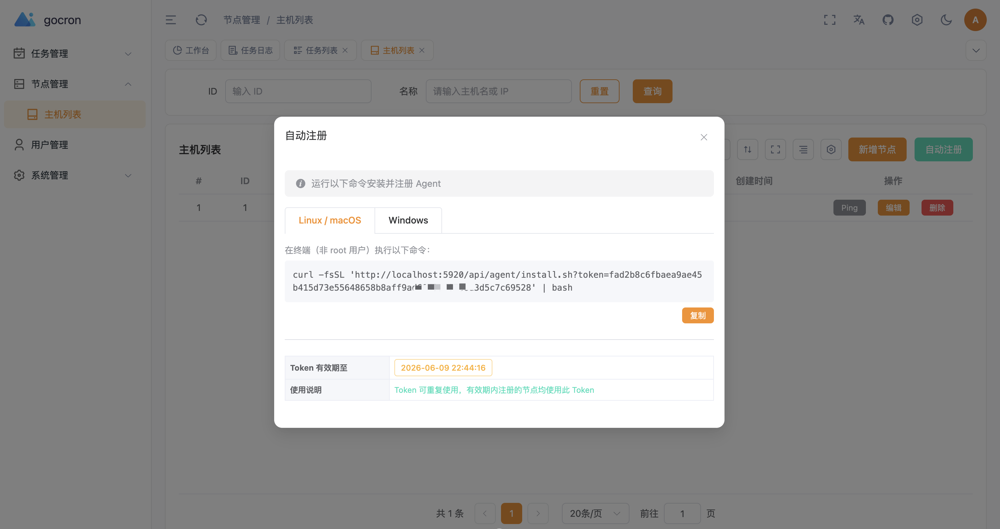
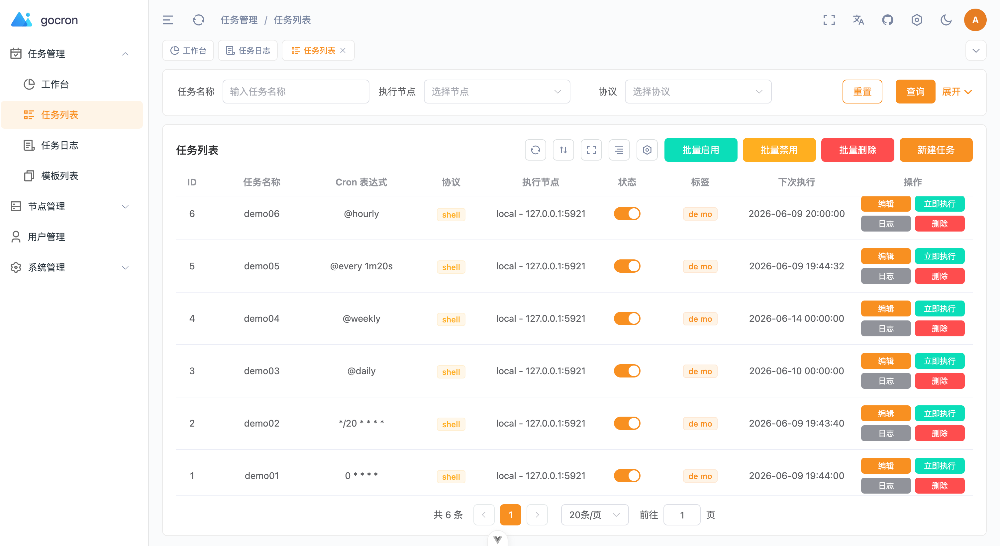
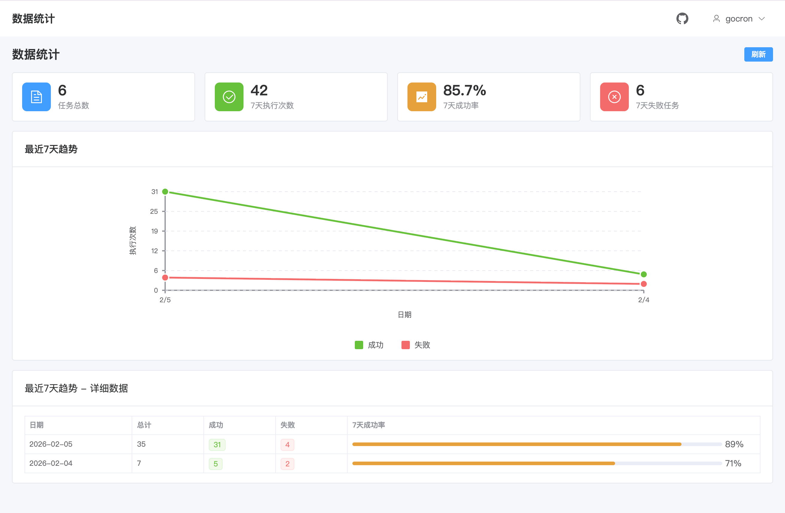
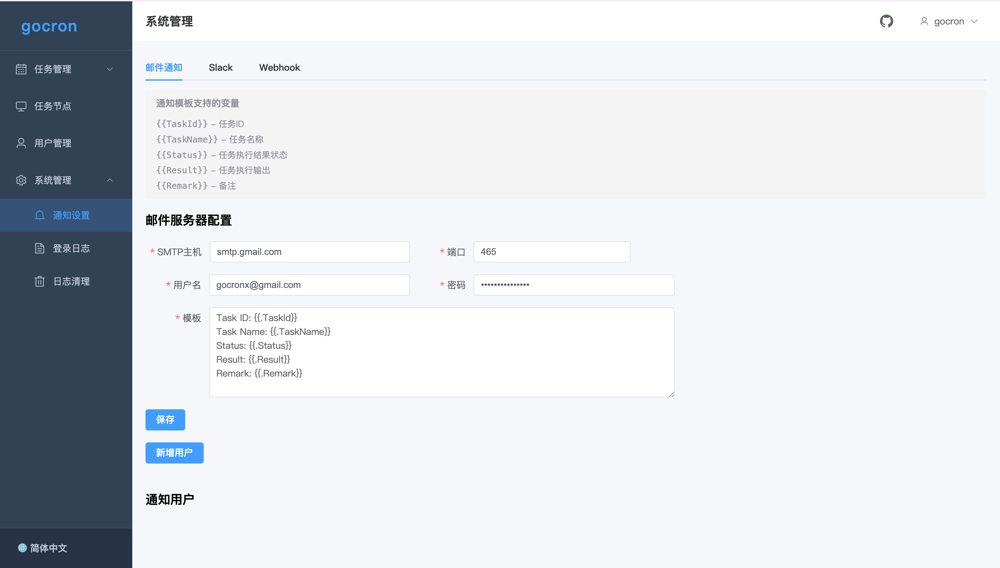

# gocron - 分布式定时任务调度系统

[](https://github.com/gocronx-team/gocron/releases) [](https://github.com/gocronx-team/gocron/releases) [](https://github.com/gocronx-team/gocron/blob/master/LICENSE)

[English](README.md) | 简体中文

使用 Go 语言开发的轻量级分布式定时任务集中调度和管理系统，用于替代 Linux-crontab。

## 📖 文档

访问完整文档请跳转：[文档](https://gocron-docs.pages.dev/zh/)

- 🚀 [快速开始](https://gocron-docs.pages.dev/zh/guide/quick-start) - 安装部署指南
- 🤖 [Agent 自动注册](https://gocron-docs.pages.dev/zh/guide/agent-registration) - 一键部署任务节点
- ⚙️ [配置文件](https://gocron-docs.pages.dev/zh/guide/configuration) - 详细配置说明
- 🔌 [API 文档](https://gocron-docs.pages.dev/zh/guide/api) - API 接口说明

## ✨ 功能特性

- **Web 界面管理**：直观的定时任务管理界面
- **秒级定时**：支持 Crontab 时间表达式，精确到秒
- **高可用**：基于数据库锁的 Leader 选举，秒级自动故障转移
- **任务重试**：支持任务执行失败重试设置
- **任务依赖**：支持配置任务依赖关系
- **多用户权限**：完善的用户和权限控制
- **双因素认证**：支持 2FA，提升系统安全性
- **Agent 自动注册**：支持 Linux/macOS 一键安装注册
- **多数据库支持**：MySQL / PostgreSQL / SQLite
- **日志管理**：完整的任务执行日志，支持自动清理
- **消息通知**：支持邮件、Slack、Webhook 等多种通知方式

## 🚀 快速开始 (Docker)

最简单的部署方式是使用 Docker Compose：

```bash
# 1. 克隆项目
git clone https://github.com/gocronx-team/gocron.git
cd gocron

# 2. 启动服务
docker-compose up -d

# 3. 访问 Web 界面
# http://localhost:5920
```

更多部署方式（二进制部署、开发环境）请查看 [安装部署指南](https://gocron-docs.pages.dev/zh/guide/quick-start)。

## 🔷 高可用部署（可选）

gocron 支持多实例部署，内置基于数据库行锁的 Leader 自动选举。只有 Leader 节点运行调度器，其他节点热备待命，Leader 故障后秒级自动接管。

### 工作原理

- 通过 `SELECT ... FOR UPDATE` 行锁实现选主，无需额外依赖
- Leader 每 5 秒续约一次（租约 15 秒）
- 自动故障转移：Leader 宕机后最多 15 秒，备用节点自动接管
- 优雅关机时立即释放锁，实现秒级切换
- **仅支持 MySQL / PostgreSQL** — SQLite 不支持多实例并发访问，SQLite 模式下自动跳过选举，以单节点运行

### 部署方式

1. 在第一个节点完成 Web 安装向导
2. 将 `.gocron/conf/` 目录（app.ini、install.lock）复制到其他节点
3. 所有节点连接**同一个 MySQL/PostgreSQL 数据库**

```bash
# 节点 1 — 先完成 Web 安装，然后启动
./gocron web --port 5920

# 节点 2 — 从节点 1 复制 .gocron/conf/ 后启动
./gocron web --port 5921
```

无需额外配置，`scheduler_lock` 表在首次启动时自动创建。

K8s/Docker 部署时，可以挂载相同配置或使用环境变量覆盖，无需手动复制文件。

### 环境变量覆盖

数据库和应用配置支持环境变量覆盖（适用于 K8s/Docker）：

| 环境变量 | 覆盖配置 |
|---|---|
| `GOCRON_DB_ENGINE` / `HOST` / `PORT` / `USER` / `PASSWORD` / `DATABASE` / `PREFIX` | 数据库配置 |
| `GOCRON_AUTH_SECRET` | JWT 认证密钥 |

## 📸 界面截图

<p align="center">
  <b>任务调度</b><br>
  
</p>

<table>
  <tr>
    <td width="50%" align="center"><b>Agent自动注册</b></td>
    <td width="50%" align="center"><b>任务管理</b></td>
  </tr>
  <tr>
    <td></td>
    <td></td>
  </tr>
</table>

<table>
  <tr>
    <td width="50%" align="center"><b>数据统计</b></td>
    <td width="50%" align="center"><b>消息通知</b></td>
  </tr>
  <tr>
    <td></td>
    <td></td>
  </tr>
</table>

## 🤝 贡献

我们非常欢迎社区的贡献！

### 如何贡献

1. **Fork 仓库**
2. **克隆你的 fork**

   ```bash
   git clone https://github.com/YOUR_USERNAME/gocron.git
   cd gocron
   ```

3. **安装依赖**

   ```bash
   pnpm install
   pnpm run prepare
   ```

4. **创建功能分支**

   ```bash
   git checkout -b feature/your-feature-name
   ```

5. **修改代码并提交**

   ```bash
   git add .
   pnpm run commit  # 使用交互式提交工具
   ```

6. **推送并创建 Pull Request**
   ```bash
   git push origin feature/your-feature-name
   ```

### 提交信息规范

本项目使用 [commitizen](https://github.com/commitizen/cz-cli) 和 [cz-git](https://cz-git.qbb.sh/) 来规范化提交信息，并自动添加表情符号前缀。

请使用以下命令代替 `git commit`：

```bash
pnpm run commit
```

这将引导你通过交互式提示创建格式正确的提交信息，例如：

- ✨ feat(task): 添加任务依赖配置
- 🐛 fix(api): 修复任务状态更新问题
- 📝 docs: 更新 API 文档

### 其他贡献方式

- 🐛 **提交 Bug**：请在 GitHub Issues 中提交
- 💡 **功能建议**：通过 Issues 分享你的想法
- 📝 **文档改进**：帮助我们完善文档

## 📄 许可证

本项目遵循 MIT 许可证。详情请见 [LICENSE](LICENSE) 文件。

## Star History

[](https://www.star-history.com/#gocronx-team/gocron&Date)
